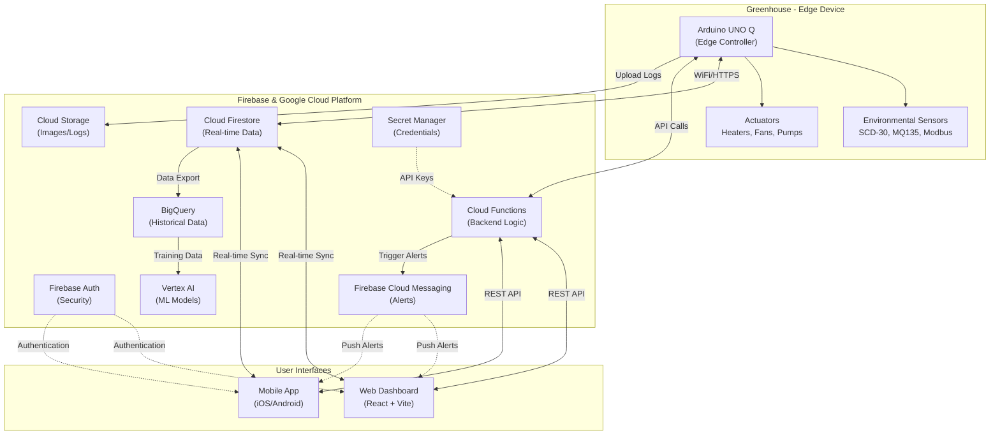

# GreenOS: Intelligent Greenhouse Controller


## 📖 Project Overview

**GreenOS** is an open-source, production-ready intelligent greenhouse control system designed for precision environmental management. Built on the **Arduino UNO Q** (Renesas RA4M1 + ESP32-S3) platform and powered by **Firebase** and **Google Cloud Platform**, GreenOS delivers industrial-grade reliability with a focus on safe-fail operation, offline resilience, and real-time responsiveness.

This comprehensive system integrates advanced sensor fusion, predictive analytics, and automated climate control to create optimal growing conditions while maintaining robust safety protocols. Designed for the demanding environment of Denver, Colorado (elevation 5,280 ft), GreenOS adapts to your local conditions while providing professional-grade monitoring and control capabilities.

| **Project Name** | GreenOS |
| :--- | :--- |
| **Domain** | [`https://greenos.app`](https://greenos.app) |
| **Greenhouse Spec** | 325 cu. ft. greenhouse in Denver, CO (5,280 ft elevation) |
| **Platform** | Arduino UNO Q (Renesas RA4M1 Cortex-M4 @ 48MHz, ESP32-S3 WiFi) |
| **Development Stage** | Hardware interface complete, cloud integration in progress |
| **Philosophy** | Safe-fail by design, data-driven decisions, offline-first operation, transparent monitoring |

---

## 🚀 Core Vision

GreenOS transforms greenhouse management by combining edge computing intelligence with cloud-scale analytics. The system operates on a fundamental principle: **plant safety first**. Every decision, from sensor placement to emergency protocols, prioritizes the health and protection of your plants through redundant monitoring, automatic failover, and offline-resilient operation.

Unlike consumer IoT devices that fail silently when connectivity drops, GreenOS is designed as an **offline-first system**. The Arduino UNO Q edge controller maintains full operational capability without internet access, buffering data locally and executing critical safety protocols autonomously. When connectivity returns, data syncs seamlessly to the cloud for analysis and long-term storage.

## ✨ Key Features

### **Edge Intelligence (Arduino UNO Q)**
*   **Multi-Sensor Fusion:** Integrates NDIR CO2 (SCD-30), air quality (MQ135), and Modbus RS485 soil sensors (EC, pH, moisture, NPK) with altitude compensation for Denver's elevation
*   **Hardware Watchdog Timer:** 8-second timeout with automatic recovery prevents firmware hangs and ensures continuous operation
*   **Finite State Machine:** Predictable system behavior through well-defined states (BOOT → SENSOR_INIT → NORMAL_OPERATION → EMERGENCY/SAFE_MODE)
*   **Sensor Health Monitoring:** Real-time error rate tracking, validation, and fallback to last known good values
*   **Offline Data Buffering:** SD card storage maintains complete operational history during network outages
*   **ADC Calibration System:** Two-point calibration with temperature compensation ensures measurement accuracy

### **Automated Climate Control**
*   **Safety Interlocks:** Prevents dangerous actuator combinations (e.g., simultaneous heating and exhaust ventilation)
*   **Duty Cycle Management:** Protects equipment through minimum cycle times and maximum runtime limits
*   **Emergency Protocols:** Automated responses to critical conditions (low temp → dual heater activation, high temp → full cooling, security breach → alarm)
*   **Gradual Adjustments:** Warning-level responses provide smooth environmental transitions
*   **Manual Override:** Physical controls and web interface allow immediate user intervention

### **Cloud Integration & Analytics**
*   **Real-time Synchronization:** Firebase Firestore provides live data visibility across all interfaces
*   **Historical Analysis:** BigQuery enables long-term trend analysis, seasonal comparisons, and ML model training
*   **Prioritized Alerting:** Multi-level alert system (ULTRA-HIGH → HIGH → MEDIUM → LOW) via Firebase Cloud Messaging
*   **Audit Trail:** Comprehensive logging of all system actions, user commands, and environmental events
*   **Predictive Insights:** Machine learning models forecast conditions and optimize resource usage (future enhancement)

### **User Experience**
*   **Diagnostic Interface:** Built-in serial commands ('s' = sensors, 'h' = health, 'c' = calibrate) for real-time debugging
*   **Web Dashboard:** Real-time gauges, charts, and controls accessible from any device
*   **Mobile App:** Push notifications and remote monitoring on iOS/Android (planned)
*   **Responsive Design:** Professional UI adapts to desktop, tablet, and mobile screens

---

## 🏗️ System Architecture

The GreenOS architecture is a hybrid edge-cloud system, combining the immediate responsiveness of the Arduino UNO Q with the scalable backend services of Firebase and Google Cloud.



### 📂 Project Structure

```txt
/GreenOS
├── /Firmware                        # Arduino UNO Q Edge Controller (✅ Complete)
│   ├── /src
│   │   ├── main.cpp                 # FSM-based main controller with WDT and offline buffering
│   │   ├── config.h                 # Hardware configuration, pin mappings, thresholds
│   │   ├── sensor_manager.h/cpp     # Multi-sensor integration (SCD-30, MQ135, Modbus)
│   │   ├── actuator_manager.h/cpp   # Safety-first actuator control with interlocks
│   │   ├── firebase_comm.h/cpp      # Real-time Firebase synchronization
│   │   └── anomaly_detection.h      # Local anomaly detection and emergency protocols
│   └── /libraries                   # External Arduino libraries
│
├── /CloudFunctions                  # Firebase Cloud Functions (🔨 In Progress)
│   ├── /functions
│   │   ├── index.js                 # Cloud function entry point
│   │   ├── triggers.js              # Firestore triggers for alerts and processing
│   │   ├── api.js                   # HTTP endpoints for historical data queries
│   │   └── scheduled.js             # Periodic tasks (BigQuery export, weather API)
│   └── package.json                 # Node.js dependencies
│
├── /WebUI                           # Web Application Frontend (📋 Planned)
│   ├── /public
│   │   ├── index.html               # Main HTML entry point
│   │   └── firebase-messaging-sw.js # Service worker for push notifications
│   ├── /src
│   │   ├── /components              # Reusable UI components (charts, gauges, alerts)
│   │   ├── /pages                   # Application pages (Dashboard, Settings, Logs)
│   │   ├── App.jsx                  # React application root
│   │   ├── config.js                # Firebase configuration
│   │   └── index.css                # Global styles
│   ├── package.json                 # Frontend dependencies
│   └── vite.config.js               # Vite build configuration
│
├── /Docs                            # 📚 Comprehensive Documentation (✅ Complete)
│   ├── QUICKSTART.md                # 30-minute getting started guide
│   ├── HARDWARE_SETUP.md            # Detailed wiring diagrams and setup instructions
│   ├── LIBRARIES.md                 # Arduino library requirements and installation
│   ├── IMPLEMENTATION_SUMMARY.md    # Technical overview and design decisions
│   ├── ArduinoUNO-Q-datasheet.pdf  # Arduino UNO Q hardware specifications
│   └── RS485SoilMoisture*.pdf      # Modbus soil sensor datasheet
│
└── /assets                          # Project assets and media
```

**Implementation Status:**
- ✅ **Firmware**: Production-ready with all sensors integrated
- 🔨 **Cloud Functions**: Partial implementation, Firebase integration active
- 📋 **Web UI**: Structure in place, components being developed
- 📚 **Documentation**: Comprehensive guides complete ├── /public
│   │   ├── index.html               (Main application file)
│   │   └── firebase-messaging-sw.js (Service worker for FCM notifications) 
│   ├── /src
│   │   ├── /components              (Reusable UI elements: Gauges, Charts, Video feeds)
│   │   ├── /pages                   (Views: Dashboard, Login, Settings, Audit Log)
│   │   ├── app.js/ts                (Application initialization and routing)
│   │   └── style.css                (San serif fonts, responsive layout)
│   └── firebase.json                (Firebase Hosting configuration)
|
├── /MobileApp (Mobile Application - e.g., Flutter or React Native)
│   ├── /android
│   ├── /ios
│   └── /lib                         (Cross-platform code using Firebase SDKs)

The **Arduino UNO Q** serves as the intelligent edge controller, providing real-time environmental management with industrial-grade reliability. Built on the Renesas RA4M1 microcontroller (ARM Cortex-M4 @ 48MHz) with ESP32-S3 WiFi coprocessor, it combines processing power with robust connectivity.

**Hardware Specifications:**
*   **Microcontroller:** Renesas RA4M1 (48 MHz ARM Cortex-M4)
*   **ADC:** 12-bit SAR ADC (0-3.3V, ⚠️ NOT 5V tolerant!)
*   **Connectivity:** WiFi (ESP32-S3), Ethernet-ready via W5100S
*   **GPIO:** 3.3V logic levels (level shifters required for 5V sensors)
*   **Watchdog:** Independent hardware watchdog with 8-second timeout
*   **Power:** 5V @ 3A via USB-C, UPS-protected for uninterrupted operation
*   **Development:** Arduino IDE 2.x (PlatformIO not supported)

**Operational Intelligence:**
*   **Finite State Machine:** Manages system lifecycle (BOOT → SENSOR_INIT → NETWORK_CONNECT → FIREBASE_AUTH → NORMAL_OPERATION)
*   **Offline Resilience:** Full operation without internet, automatic data sync on reconnection
*   **Memory Management:** Continuous heap monitoring, safe-mode entry on low memory conditions
*   **Auto-Recovery:** Hardware watchdog prevents permanent firmware hangs
*   **Diagnostic Access:** Serial command interface for real-time system inspection

### 2. Sensors & Actuators (Hardware)

GreenOS integrates professional-grade sensors optimized for greenhouse environments, with altitude compensation configured for Denver's 5,280 ft elevation.

**Environmental Monitoring:**

| Sensor | Model | Interface | Measurements | Notes |
|--------|-------|-----------|--------------|-------|
| **CO2/Climate** | Adafruit SCD-30 | I2C (0x61) | CO2 (ppm), Temperature (°C), Humidity (%) | NDIR sensor with altitude compensation, auto-calibration enabled |
| **Air Quality** | MQ135 | Analog ADC | Air quality (ppm) | Requires 48-hour preheat, voltage divider (5V→3.3V) mandatory |
| **Soil Monitor** | S-Soil MT-02 | Modbus RTU RS485 | EC (mS/cm), pH, Moisture (%), Temp (°C), N-P-K (mg/kg) | Industrial-grade probe, IP68 waterproof |
| **Motion** | PIR Sensor | Digital GPIO | Motion detection | Security monitoring, off-hours alerts |
| **Power** | UPS Monitor | Digital GPIO | Power status | Triggers power-saving mode on mains failure |

**Actuator Control (5V Optoisolated Relays, 15A Rating):**

| Actuator | Power | Control Logic | Safety Features |
|----------|-------|---------------|-----------------|
| **Primary Heater** | 1500W @ 120VAC | PWM-capable relay | Interlock with exhaust fan, duty cycle limiting |
| **Secondary Heater** | 1500W @ 120VAC | Backup heating | Auto-activation on primary failure or extreme cold |
| **Exhaust Fan** | Variable | Speed-controlled relay | Cannot run simultaneously with heaters |
| **Circulation Fan** | Variable | Always-on capable | Distributes heat/cool air evenly |
| **Irrigation Pump** | 120VAC | Timed relay | 10-minute maximum runtime protection |
| **Grow Lights** | LED Array | Scheduled relay | Automated day/night cycles |

**Critical Design Note:** All sensors interfacing with 3.3V GPIO pins require level shifting or voltage dividers. The MQ135 analog output (0-5V) uses a resistor divider (R1=10kΩ, R2=20kΩ) to safely scale to 3.3V maximum
    *   **VWC:** Capacitive soil moisture sensors.
    Safe-Fail Operation Philosophy

GreenOS is architected on the principle that **failure modes must be safe by default**. Unlike consumer IoT devices that simply stop functioning when problems occur, GreenOS implements graduated responses:

1. **Normal Operation:** All systems functioning, cloud-synced
2. **Degraded Mode:** Sensor failures detected, system uses last known good values
3. **Safe Mode:** Critical failures, maintains only essential life-support (heating in winter)
4. **Emergency Mode:** Immediate threat to plants, executes protective protocols automatically

### Internet Connectivity & Offline Resilience

**WiFi-First Architecture:**
*   **Primary:** 2.4GHz WiFi (ESP32-S3 coprocessor, does not support 5GHz)
*   **Connection Management:** Non-blocking connection with 10-second timeout
*   **Auto-Reconnection:** 30-second intervals, continues operation during outages
*   **Signal Monitoring:** RSSI tracking, logs connection quality
*   **Future Enhancement:** Ethernet failover via W5100S module (hardware-ready)

**Offline Operation:**
GreenOS maintains full autonomous operation without internet connectivity:
*   **Local Data Buffering:** SD card stores up to 100 readings in RAM, unlimited on SD
*   **CSV Format:** Human-readable logs for easy offline analysis
*   **Automatic Sync:** Uploads buffered data when connection restored
*   **Emergency Protocols:** Execute locally without cloud confirmation
*   **Alert Logging:** Saves alerts to SD card for post-reconnection upload

### Power Management & UPS Integration

**Power Supply Architecture:**
*   **Primary:** 120VAC mains via multiple isolated 5V DC adapters
*   **Arduino UNO Q:** Dedicated 5V/3A USB-C supply
*   **Sensors:** Isolated 5V rail (prevents sensor noise from affecting MCU)
*   **Actuators:** 5V relay board with optoisolation (120VAC loads isolated from logic)
*   **Soil Sensor:** Dedicated 12-24V DC supply (Modbus RS485 sensor requirement)

**UPS Monitoring & Response:**
*   **Status Detection:** Digital GPIO monitors UPS mains/battery status
*   **Power Failure Protocol:** 
  - Disables high-power actuators (heaters, grow lights)
  - Maintains critical monitoring and minimal ventilation
  - Logs power event to SD card
  - Sends alert when connectivity available
*   **Battery Runtime:** Estimated 4-6 hours on UPS for monitoring only

### Anomaly Detection & Emergency Protocols

**Multi-Tier Alert System:**

| Priority | Conditions | Response Time | Actions |
|----------|-----------|---------------|---------|
| 🔴 **ULTRA** | Temp < 10°C (frost danger) | Immediate | Activate both heaters, disable cooling, alert sent |
| 🔴 **ULTRA** | Temp > 35°C (heat stress) | Immediate | Full ventilation, disable heaters, disable grow lights |
| 🟠 **HIGH** | Security breach (motion off-hours) | < 30 seconds | Activate lights, sound alarm, send alert with photo |
### Current Security Implementation

**Network Security:**
*   **Encryption:** All cloud communications via HTTPS/TLS 1.2+
*   **WiFi:** WPA2-Personal encryption (WPA3 when available)
*   **Firebase Auth:** API key-based device authentication
*   **Firestore Rules:** Read/write restrictions based on authentication

**Data Integrity:**
*   **CRC32 Validation:** All EEPROM calibration data verified on load
*   **Sensor Validation:** Sanity checks prevent invalid data propagation
*   **Alert Verification:** Multi-sensor correlation reduces false positives

**Physical Security:**
*   **Tamper Detection:** PIR motion sensor triggers off-hours alerts
*   **Enclosure:** Weather-resistant housing protects electronics
*   **UPS Protection:** Prevents data loss and maintains monitoring during outages

### Production Security Enhancements (Roadmap)

**Credential Management:**
*   **Current:** WiFi credentials and API keys in source code (acceptable for development/breadboard testing)
*   **Planned:** 
  - EEPROM-based credential storage (encrypted)
  - Web-based provisioning portal (captive WiFi for initial setup)
  - Firebase device tokens instead of API keys
  - Google Cloud Secret Manager for cloud-side credentials

**Firmware Security:**
*   **Planned:**
  - Secure boot (cryptographic verification of firmware)
  - Code signing for OTA updates
### Quick Start (30 Minutes)

Get your Arduino UNO Q running with GreenOS firmware:

1. **Install Development Environment**
   - Download [Arduino IDE 2.x](https://www.arduino.cc/en/software)
   - Install Arduino UNO R4 board support package
   - Install required libraries (see `Docs/LIBRARIES.md`)

2. **Configure Hardware**
   - Connect Arduino UNO Q via USB-C
   - Wire SCD-30 sensor (minimum for testing)
   - Optional: Add MQ135 with voltage divider, Modbus soil sensor

3. **Upload Firmware**
   - Open `Firmware/src/main.cpp` in Arduino IDE
   - Update WiFi credentials in `config.h`
   - Click Upload (firmware compiles in ~2 minutes)

4. **Verify Operation**
   - Open Serial Monitor (115200 baud)
   - Watch boot sequence and sensor initialization
   - Press 's' to display sensor readings
   - Press 'h' for sensor health report

**📖 Detailed Guides:**
- **[QUICKSTART.md](Docs/QUICKSTART.md)** - Step-by-step first boot guide
- **[HARDWARE_SETUP.md](Docs/HARDWARE_SETUP.md)** - Complete wiring diagrams and setup
- **[LIBRARIES.md](Docs/LIBRARIES.md)** - Arduino library requirements
- **[IMPLEMENTATION_SUMMARY.md](Docs/IMPLEMENTATION_SUMMARY.md)** - Technical deep-dive

### Hardware Requirements

**Minimum Setup (Testing):**
- Arduino UNO Q with USB-C cable
- Adafruit SCD-30 CO2 sensor
- 5V power supply
- Computer with Arduino IDE 2.x

**Full Production Setup:**
- All minimum components, plus:
- MQ135 air quality sensor + voltage divider components (R1=10kΩ, R2=20kΩ)
- Modbus RS485 soil sensor (S-Soil MT-02)
- MAX485 TTL-to-RS485 transceiver module
- SD card module for offline buffering
- 6-channel 5V relay board (optoisolated, 15A rating)
- PIR motion sensor for security
- UPS with status monitoring
- Level shifter module (3.3V ↔ 5V) for I2C if needed

**⚠️ Critical:** Arduino UNO Q uses 3.3V logic. Do not connect 5V signals directly to GPIO pins!

### Software Dependencies

**Arduino Libraries** (install via Library Manager):
- Adafruit SCD30 (v1.0.11+)
- ModbusMaster (v2.0.1+)
- ArduinoJson (v6.21.3+, NOT v7)
- Firebase ESP Client (v4.4.7+)
- Adafruit BusIO (auto-installed)

**Development Tools:**
- Arduino IDE 2.x or later
- Arduino UNO R4 board support package
- Serial terminal (built into Arduino IDE)

### Project Roadmap

**✅ Phase 1: Hardware Interface (Complete)**
- ✅ Sensor integration (SCD-30, MQ135, Modbus RS485)
- ✅ Hardware watchdog timer
- ✅ Finite state machine architecture
- ✅ Offline data buffering
- ✅ Safety interlocks and emergency protocols
- ✅ Comprehensive documentation

**🔨 Phase 2: Cloud Integration (In Progress)**
- 🔨 Firebase Cloud Functions for alerts
- 🔨 BigQuery data pipeline
- 📋 Historical data analysis tools
- 📋 Machine learning anomaly detection

**📋 Phase 3: User Interfaces (Planned)**
- 📋 Web dashboard (React + Vite)
- 📋 Real-time gauges and charts
- 📋 Mobile app (iOS/Android)
- 📋 Push notification system

**📋 Phase 4: Advanced Features (Future)**
- 📋 OTA firmware updates
- 📋 Predictive analytics and forecasting
- 📋 Camera integration and plant identification
- 📋 Multi-greenhouse management
- 📋 Third-party integrations (weather APIs, etc.)

### Contributing

GreenOS is open-source and welcomes contributions! Areas where help is needed:

- **Firmware:** Additional sensor drivers, optimization, battery mode
- **Cloud Functions:** Advanced analytics, ML model integration
- **Web UI:** Dashboard components, mobile responsiveness
- **Documentation:** Tutorials, translations, case studies
- **Testing:** Real-world greenhouse deployments, edge cases

See `CONTRIBUTING.md` for guidelines (coming soon).

### License

This project is licensed under the MIT License - see the LICENSE file for details.

### Support & Community

**Documentation:** Comprehensive guides available in the `Docs/` folder

**Issues:** Report bugs or request features via GitHub Issues

**Discussions:** Ask questions and share experiences in GitHub Discussions

### Acknowledgments

Built with:
- [Arduino](https://www.arduino.cc/) - UNO Q platform
- [Adafruit](https://www.adafruit.com/) - SCD-30 sensor and libraries
- [Firebase](https://firebase.google.com/) - Real-time backend
- [Google Cloud](https://cloud.google.com/) - Analytics and ML

Special thanks to the open-source community for libraries, tools, and inspiration.

---

## 📞 Contact

**Pat Ryan**  
📧 [pat@patryan.com](mailto:pat@patryan.com)  
🌐 [https://greenos.app](https://greenos.app)

---

**GreenOS** - Safe-fail by design. Offline-first operation. Production-ready reliability.

*Last Updated: December 15, 2025 | Firmware Version: v1.0 | Status: Hardware interface complete, cloud integration in progress*ections
  - Certificate pinning for Firebase endpoints
  - VPN option for remote access to web dashboard
  - Intrusion detection monitoring

**Audit & Compliance:**
*   **Current:** Comprehensive logging of all system actions
*   **Planned:**
  - Cryptographic audit log signing
  - Tamper-evident log storage
  - Compliance with agricultural data standards
*   **Low Temperature:** Dual heater activation + circulation fan
*   **High Temperature:** Maximum ventilation + heater shutoff + grow light disable
*   **Water Leak:** Immediate irrigation pump shutoff
*   **Security Breach:** All lights on + alarm activation
*   **Power Failure:** UPS mode (minimal power draw, critical monitoring only)

**Safety Interlocks:**
The firmware enforces physical safety rules to prevent equipment damage:
*   Heaters and exhaust fans cannot run simultaneously (prevents heat loss)
*   Minimum 60-second delay between actuator state changes (prevents relay wear)
*   Maximum 10-minute continuous pump runtime (prevents flooding)
*   Duty cycle tracking prevents excessive heater operation (fire safety)

### Data Management & Logging

**Multi-Tier Data Architecture:**

1. **Edge Storage (Arduino UNO Q):**
   - Real-time sensor readings (5-second intervals)
   - Circular buffer: 100 readings in RAM (~4KB)
   - SD card: Unlimited CSV storage during offline periods
   - Alert logs: Critical events stored locally

2. **Cloud Firestore (Real-time):**
   - Recent data: Last 24-48 hours
   - Live dashboard updates
   - User configuration and thresholds
   - System state and health metrics
   - Purpose: Low-latency access for web/mobile UI

3. **BigQuery (Historical):**
   - Long-term retention: Indefinite
   - Full sensor history for trend analysis
   - Seasonal comparisons and yearly patterns
   - Machine learning training datasets
   - Purpose: Advanced analytics and reporting

**Data Synchronization:**
*   **Online:** Firebase sync every 60 seconds
*   **Offline:** Buffered to SD card, sync on reconnection
*   **Conflict Resolution:** Edge device is source of truth for sensor data
*   **Data Integrity:** CRC32 checksums on EEPROM calibration data

### Firmware Updates & Maintenance

**Configuration Updates:**
*   **Method:** Firestore-based parameter sync
*   **Scope:** Sensor thresholds, timing intervals, alert priorities
*   **Speed:** Near-instant (< 5 seconds)
*   **Safety:** Validated before application, rollback on failure

**Firmware Updates (OTA - Future Enhancement):**
*   **Status:** Deferred to Phase 2 per project requirements
*   **Current Method:** USB cable upload via Arduino IDE
*   **Planned Implementation:** Secure HTTPS download with cryptographic verification
*   **Safety:** Rollback mechanism if new firmware fails health checks
---

## 🛡️ Critical System Aspects

### Internet Connectivity (UNO Q)
*   **Primary:** Wi-Fi.
*   **Fallback:** Ethernet option for enhanced reliability.
*   **Stability:** Strategic AP placement, potential external antennas, and local data buffering.

### Power Management
*   **Main:** 120V AC.
*   **Backup:** UPS for continuous operation.
*   **Monitoring:** GreenOS monitors UPS status and triggers alerts/power-saving modes.

### Anomaly Detection & Safe-Fail Systems
*   **Rapid Response:** Local anomaly detection on UNO Q.
*   **Prioritized Alerts:**
    *   🔴 **ULTRA-HIGH:** Low temperature (catastrophic). Triggers immediate heating.
    *   🟠 **HIGH:** Security breach, high temp/fire, critical equipment malfunction.
    *   🟡 **MEDIUM:** Loud noise, minor equipment issues.
*   **Automated Actions:** Configurable responses for critical events.

### Data Management & Logging
*   **Logging:** Comprehensive logs stored in Cloud Firestore.
*   **Data Retention:** Indefinite retention in BigQuery.
*   **UI Visualization:** Linear graphs leveraging Firestore (recent) and BigQuery (historical).

### Over-The-Air (OTA) Updates
*   **Configuration:** Parameters updated in Firestore, synced to UNO Q.
*   **Firmware:** Secure download and application of new binaries with rollback mechanisms.

---

## 💻 User Interfaces

### Web Application (`https://greenos.app`)
*   **Platform:** Firebase Hosting.
*   **Features:** Secure login, professional dashboard, real-time gauges, charts, video feeds.
*   **Technology:** HTML, CSS, JavaScript, Chart.js/D3.js.

### Mobile Application (iOS/Android)
*   **Platform:** Native or Cross-platform (Flutter/React Native).
*   **Features:** Functional parity with web app, responsive UI.
*   **Notifications:** Firebase Cloud Messaging.

---

## 🔒 Security & Best Practices

*   **Web Security:** SSL/TLS for all traffic.
*   **Secure Credentials:** Managed via Google Cloud Secret Manager.
*   **Firmware Hardening:** Secure boot, disabled debugging ports.
*   **Network Security:** Firewall rules restricting outbound connections.
*   **Physical Security:** Enclosure protection from environment.

---

## 🏁 Getting Started

*(Placeholder: Instructions on how to set up the project, contribute, or deploy GreenOS.)*

## 📞 Contact

**Pat Ryan**  
📧 [pat@patryan.com](mailto:pat@patryan.com)
