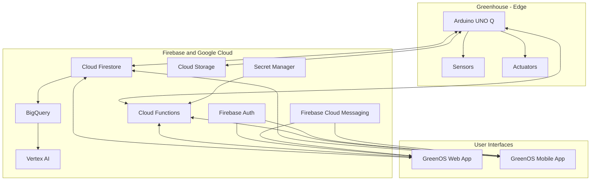

# GreenOS: Intelligent Greenhouse Controller

## 📖 Project Overview

**GreenOS** is an ambitious open-source project aimed at developing a sophisticated, intelligent, and resilient control system for backyard greenhouses. Leveraging the power of the **Arduino UNO Q** at the edge, combined with the scalable and real-time capabilities of **Firebase** and **Google Cloud**, GreenOS provides precise environmental control, real-time data analysis, predictive insights, and robust safe-fail mechanisms to ensure optimal plant growth and protection.

This document outlines the architectural design of GreenOS, detailing how various components integrate to deliver a full-featured greenhouse management solution, accessible via both web and mobile interfaces.

| **Project Name** | GreenOS |
| :--- | :--- |
| **Domain** | [`https://greenos.app`](https://greenos.app) |
| **Greenhouse Spec** | Approx. 325 cu. ft. located in Denver, CO. |
| **Philosophy** | Open-source, data-driven, safe-fail mechanisms, user override, real-time monitoring, and predictive analytics. |

---

## 🚀 Core Vision

The primary goal of GreenOS is to empower greenhouse managers with an intuitive, powerful, and reliable system that automates environmental control, detects anomalies, and provides actionable insights. The system prioritizes plant safety by implementing rapid-response safe-fail protocols for critical conditions while enabling long-term data analysis for continuous optimization.

## ✨ Key Features

*   **Real-time Environmental Monitoring:** Continuous tracking of critical parameters like temperature (air, substrate), humidity, CO2, VWC, pH, EC, PAR, and more.
*   **Automated Climate Control:** Intelligent management of heating, cooling, ventilation, and irrigation based on user-defined thresholds and predictive models.
*   **Anomaly Detection:** On-device and cloud-based systems for identifying unusual conditions (e.g., equipment malfunction, security breaches, leaks).
*   **Critical Alerts & Notifications:** Immediate, prioritized alerts via Firebase Cloud Messaging for urgent events (e.g., low temperature, fire, security breach).
*   **Image Processing & Plant Identification:** Leveraging camera feeds for plant family/species identification and general visual monitoring.
*   **Robust Logging & Audit Trail:** Comprehensive recording of system events, sensor data, and user actions for transparency and analysis.
*   **Historical Data Analysis:** Long-term data retention and visualization for seasonal comparison, trend identification, and machine learning model training.
*   **Predictive Analytics:** Utilizing machine learning to forecast environmental conditions, optimize resource usage, and predict plant health outcomes.
*   **User-Friendly Interfaces:** Responsive web and mobile applications with customizable dashboards, real-time gauges, charts, and remote control capabilities.
*   **Over-the-Air (OTA) Updates:** Secure and user-approved firmware and configuration updates for the UNO Q.

---

## 🏗️ System Architecture

The GreenOS architecture is a hybrid edge-cloud system, combining the immediate responsiveness of the Arduino UNO Q with the scalable backend services of Firebase and Google Cloud.

### 1. Arduino UNO Q (Edge Device)
The UNO Q serves as the primary controller within the greenhouse, responsible for real-time interaction with the physical environment.

*   **Role:** Sensor data collection, local processing, direct control of actuators, and secure communication with the cloud.
*   **Key Functions:**
    *   **Sensor Interfacing:** Reading data from all connected environmental sensors.
    *   **Actuator Control:** Directly activating heaters, fans, pumps, lights via relays.
    *   **Local Anomaly Detection:** Monitoring critical parameters for immediate deviations.
    *   **Image Capture:** Capturing images based on motion or schedule.
    *   **Connectivity:** Primary Wi-Fi with Ethernet fallback.
    *   **Power:** Powered by 5V @ 3A USB-C, connected to UPS-protected 120V AC.

### 2. Sensors & Actuators (Hardware)
A comprehensive suite of sensors and actuators is crucial for precise control and monitoring:

*   **Environmental Sensors:**
    *   **VWC:** Capacitive soil moisture sensors.
    *   **pH & EC:** Probes for root-zone/feed-solution.
    *   **Climate:** DHT22/BME280 (Temp/Humidity), MQ-135 (Air Quality), NDIR CO2.
    *   **Other:** DS18B20 (Substrate Temp), PAR sensors, PIR Motion, Microphone, Flow, Power.
*   **Actuators:**
    *   **Climate:** Heaters (1500W), Ventilation Fans.
    *   **Irrigation:** Pumps, Solenoid Valves.
    *   **Lighting:** Grow lights.

### 3. Firebase Services (Backend & Real-time)
Firebase provides the real-time, scalable backend infrastructure.

*   **Cloud Firestore / Realtime Database:** Real-time data storage, configuration management, and event logging.
*   **Firebase Authentication:** Secure user management.
*   **Cloud Functions:** Backend logic, advanced analytics, AI/ML integration, and external integrations.
*   **Firebase Cloud Messaging (FCM):** Critical alerts and push notifications.
*   **Firebase Hosting:** Secure web application hosting.
*   **Cloud Storage:** Media storage for images and video.

### 4. Google Cloud Services (Analytics & Advanced AI)
Google Cloud complements Firebase with robust capabilities for big data analytics and machine learning.

*   **BigQuery:** Historical data warehouse and pre-aggregated data storage.
*   **AI Platform / Vertex AI:** ML model training and deployment.
*   **Google Cloud Vision AI:** Advanced image processing for plant identification.
*   **Google Cloud Secret Manager:** Secure credential management.

---

## 🛡️ Critical System Aspects

### Internet Connectivity (UNO Q)
*   **Primary:** Wi-Fi.
*   **Fallback:** Ethernet option for enhanced reliability.
*   **Stability:** Strategic AP placement, potential external antennas, and local data buffering.

### Power Management
*   **Main:** 120V AC.
*   **Backup:** UPS for continuous operation.
*   **Monitoring:** GreenOS monitors UPS status and triggers alerts/power-saving modes.

### Anomaly Detection & Safe-Fail Systems
*   **Rapid Response:** Local anomaly detection on UNO Q.
*   **Prioritized Alerts:**
    *   🔴 **ULTRA-HIGH:** Low temperature (catastrophic). Triggers immediate heating.
    *   🟠 **HIGH:** Security breach, high temp/fire, critical equipment malfunction.
    *   🟡 **MEDIUM:** Loud noise, minor equipment issues.
*   **Automated Actions:** Configurable responses for critical events.

### Data Management & Logging
*   **Logging:** Comprehensive logs stored in Cloud Firestore.
*   **Data Retention:** Indefinite retention in BigQuery.
*   **UI Visualization:** Linear graphs leveraging Firestore (recent) and BigQuery (historical).

### Over-The-Air (OTA) Updates
*   **Configuration:** Parameters updated in Firestore, synced to UNO Q.
*   **Firmware:** Secure download and application of new binaries with rollback mechanisms.

---

## 💻 User Interfaces

### Web Application (`https://greenos.app`)
*   **Platform:** Firebase Hosting.
*   **Features:** Secure login, professional dashboard, real-time gauges, charts, video feeds.
*   **Technology:** HTML, CSS, JavaScript, Chart.js/D3.js.

### Mobile Application (iOS/Android)
*   **Platform:** Native or Cross-platform (Flutter/React Native).
*   **Features:** Functional parity with web app, responsive UI.
*   **Notifications:** Firebase Cloud Messaging.

---

## 🔒 Security & Best Practices

*   **Web Security:** SSL/TLS for all traffic.
*   **Secure Credentials:** Managed via Google Cloud Secret Manager.
*   **Firmware Hardening:** Secure boot, disabled debugging ports.
*   **Network Security:** Firewall rules restricting outbound connections.
*   **Physical Security:** Enclosure protection from environment.

---

## 🏁 Getting Started

*(Placeholder: Instructions on how to set up the project, contribute, or deploy GreenOS.)*

## 📞 Contact

*(Placeholder: Contact information for project maintainers.)*
